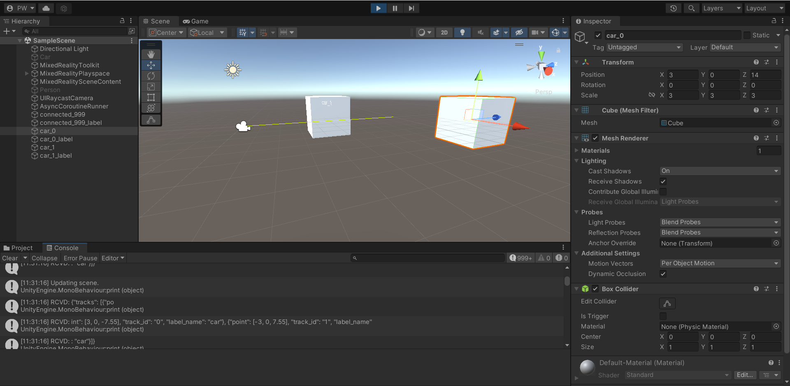

# unity-tcp
Part of the CACI Intern Beholder efforts.

## Usage
1. [OPTIONAL] `python -m venv .venv` and `source .venv/bin/activate` (or `.venv\Scripts\activate` for Windows)
2. `pip install -r requirements.txt`
3. run Unity scene (should have TCP.cs component attached to main camera to work and prefabs called car and person attached to the GameObjects in the script).
4. `python user_input.py`  (initializes tcp client to connect to Unity TCP server)

## HoloLens Setup/Tips
> There is a prebuilt solution in the [Build](./unity/Build/) folder.
1. If the configuration from cloning doesn't work, I highly recommend just following Microsoft's guide for setup:
    - [Unity Development for Hololens](https://docs.microsoft.com/en-us/windows/mixed-reality/develop/unity/unity-development-overview)
    - [MRTK Project Setup](https://docs.microsoft.com/en-us/learn/modules/learn-mrtk-tutorials/1-1-introduction)
2. Make sure when re-compiling to delete the build folder and check permission configurations (allow private network connections, etc.)
3. Try pinging the HoloLens to make sure you are on the correct network
4. You can use the voice command "What is my IP" to quickly get the IP.
5. Ensure both devices on either end of the JSON stream are on the same network and can communicate.
6. Currently the JSON stream adds a newline ('\n') delimiter between objects for parsing.

## Other
- An example python TCP client: [client.py](./client.py)
- A script to get photo metadata: [exif_rem.py](./exif_rem.py)
